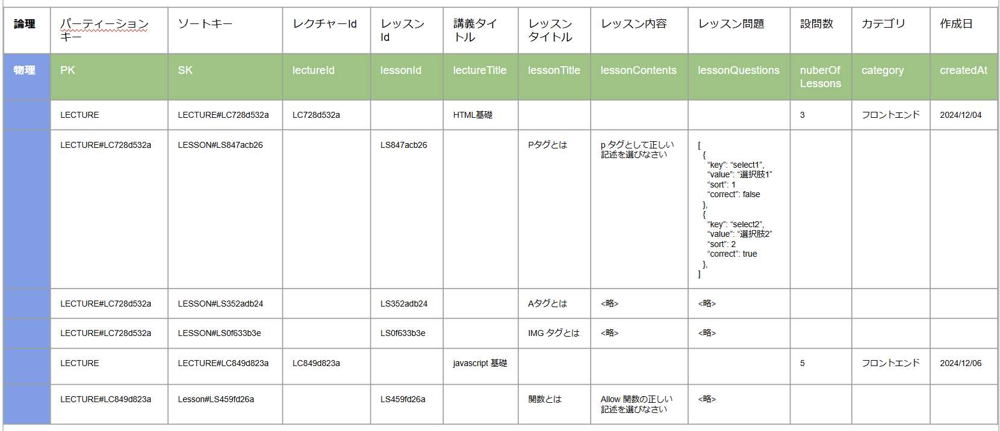

# e-learning フロントエンド作成

## 1. 講義一覧の取得の実装

### プロンプト
下記講義一覧のワイヤーフレームに沿ったNext.js のコードを作成してください。  
ただし下記の条件に沿って記述してください。
- tsx ファイルで作成
- サンプルレスポンスデータはこちらで実装してください
- インポートパッケージは下記を利用してください
  - lucide-react
- CSS フレームワークは `tailwindcss` を利用してください
- カテゴリ検索は下記で検索できるようにしてください。
  `const categories = ['すべてのカテゴリー', 'FE', 'BE'];`

```json
[
  {
    "lectureId": "LC8f6011e9",
    "lectureTitle": "HTML 基礎",
    "category": "FE",
    "nuberOfLessons": 5,
    "createdAt": "2024/12/12"
  },
  {
    "lectureId": "LC46a49d34",
    "lectureTitle": "javascript 基礎",
    "category": "BE",
    "nuberOfLessons": 5,
    "createdAt": "2024/12/12"
  }
]
```


出力されたコードに use client を追加する
ファイルの拡張子を .tsx に変更する

```shell
pnpm install lucide-react
pnpm run dev
```


以降 バックエンド側の実装へ


### 講義（Lecture）一覧取得 API の作成

一度チュートリアル環境を削除します。

`sls remove`

プロンプトを参考にコードを作成します。


デプロイします。

`sls deploy`

データを投入して、動作確認を行います。

```json
{
 "PK": "LECTURE",
 "SK": "LECTURE#LC42394D34",
 "category": "BE",
 "createdAt": "2024/12/12",
 "lectureId": "LC42394D34",
 "lectureTitle": "GO 言語基礎",
 "nuberOfLessons": 5
}

{
 "PK": "LECTURE",
 "SK": "LECTURE#LC8f6011e9",
 "category": "FE",
 "createdAt": "2024/12/12",
 "lectureId": "LC8f6011e9",
 "lectureTitle": "HTML基礎",
 "nuberOfLessons": 5
}

{
 "PK": "LECTURE",
 "SK": "LECTURE#LC5a3254d2",
 "category": "BE",
 "createdAt": "2024/01/15",
 "lectureId": "LC5a3254d2",
 "lectureTitle": "Python基礎",
 "nuberOfLessons": 5
}
```

▼ 全件取得  
`curl -H 'Content-Type: application/json' -X GET "https://<ID>.execute-api.us-east-1.amazonaws.com/dev/lectures" | jq`

▼ カテゴリ検索  
`curl -H 'Content-Type: application/json' -X GET "https://<ID>.execute-api.us-east-1.amazonaws.com/dev/lectures?category=FE" | jq`

▼ タイトル検索  
`curl -H 'Content-Type: application/json' -X GET "https://<ID>.execute-api.us-east-1.amazonaws.com/dev/lectures?title=HTML" | jq`


### プロンプト

#### Serverless.yml の DynamoDB テーブル作成用プロンプト

- 添付のテーブル構造を持つ DynamoDB を生成します。
- 下記コードサンプルに沿って serverless.yml に定義を作成してください。
- ただし GSI は作成しなくてよいです。

※ テーブル構造.png の画像を添付する



```yml
org: syoiminserver
app: e-learning
service: e-learning

stages:
  default:
    params:
      tableName: "main-table-${sls:stage}"

provider:
  name: aws
  runtime: nodejs20.x
  iam:
    role:
      statements:
        - Effect: Allow
          Action:
            - dynamodb:Query
            - dynamodb:Scan
            - dynamodb:GetItem
            - dynamodb:PutItem
            - dynamodb:UpdateItem
            - dynamodb:DeleteItem
          Resource:
            - Fn::GetAtt: [MainTable, Arn]
  environment:
    USERS_TABLE: ${param:tableName}

functions:
  api:
    handler: handler.handler
    events:
      - http:
          path: /lectures # 講義一覧取得
          method: GET
          cors: true
      - http:
          path: /lectures # 講義一覧作成
          method: POST
          cors: true     
      - http:
          path: /lectures/{lectureId}/lessons # 設問一覧取得
          method: GET
          cors: true 

resources:
  Resources:
    MainTable:
  // ここにテーブル定義を追加
```

#### API 作成用プロンプト
※ step2用 の画像を添付する


下記の条件を満たした講義一覧を DynamoDB から取得する処理を作成してください。

- 講義一覧を取得する際には QuryCommand を利用してください
- DynamoDB のデータ構造は添付の画像の様になっています。SK が LECTURE# で始まる Lecture 一覧を取得してください。
- 検索はフィルタ式を利用してクエリパラメータの下記を満たして検索できるようにしてください
  - `GET: /lectures?category=<カテゴリ文字列>&title=<タイトル文字列>`
  - カテゴリ文字列、タイトル文字列ともに部分一致検索に対応してください
  - レスポンスは下記 JSON フォーマットで返却してください

```json
[
  {
      "lectureId": string,
      "lectureTitle": string,
      "category": string,
      "nuberOfLessons": number,
      "createdAt": string
  }
]
```

- 下記コードの 「// ここにコードを追加」 の部分に実装してください

```js
const { DynamoDBClient } = require("@aws-sdk/client-dynamodb");

const {
  DynamoDBDocumentClient,
  QueryCommand
} = require("@aws-sdk/lib-dynamodb");

const express = require("express");
const serverless = require("serverless-http");

const app = express();

const USERS_TABLE = process.env.USERS_TABLE;
const client = new DynamoDBClient();
const docClient = DynamoDBDocumentClient.from(client);

app.use(express.json());

// ユーザ一覧の取得
app.get("/lectures", async (req, res) => {
  const params = {
    TableName: USERS_TABLE,
  };
  // CORS ヘッダーを設定
  res.header('Access-Control-Allow-Origin', '*');
  res.header('Access-Control-Allow-Headers', 'Origin, X-Requested-With, Content-Type, Accept');
  
  try {
    // ここにコードを追加
  } catch (error) {
    console.log(error);
    res.status(500).json({ error: "Could not retrieve user" });
  }
});
```

最後にデプロイを行う
`sls deploy`

## 2. Step2 講義一覧フロントエンドとAPIのつなぎ込み

### プロンプト
サンプルで作成した講義一覧のフロントコードとAPIをつなぎ込んでください。  
エンドポイントは環境変数から取得するようにしてください。  
エンドポイントは `GET: /lectures?category=<category>&title=<title>` です。

レスポンスBodyは下記のとおりです。

▼ レスポンス Body
```json
[
  {
    "lectureId": "LC42394D34",
    "lectureTitle": "GO 言語基礎",
    "category": "BE",
    "nuberOfLessons": 5,
    "createdAt": "2024/12/12"
  },
  {
    "lectureId": "LC4320611c",
    "lectureTitle": "HTML 基礎",
    "category": "FE",
    "nuberOfLessons": 0,
    "createdAt": "2025/01/01"
  }
]
```

```js
// app/questions/page.tsx
'use client';

import { useState } from 'react';
import { Pencil, Trash2 } from 'lucide-react';

interface Lecture {
  lectureId: string;
  lectureTitle: string;
  category: string;
  nuberOfLessons: number;
  createdAt: string;
}

// サンプルデータ
const sampleData: Lecture[] = [
  {
    lectureId: "LC8f6011e9",
    lectureTitle: "HTML基礎",
    category: "FE, BE",
    nuberOfLessons: 5,
    createdAt: "2024/12/12"
  }
];

export default function QuestionList() {
  const [searchTerm, setSearchTerm] = useState('');
  const [selectedCategory, setSelectedCategory] = useState('すべてのカテゴリー');

  // カテゴリーの一覧を取得
  const categories = ['すべてのカテゴリー', 'BE', 'FE'];

  // 検索とフィルタリングの処理
  const filteredData = sampleData.filter(item => {
    const matchesSearch = item.lectureTitle.toLowerCase().includes(searchTerm.toLowerCase());
    const matchesCategory = selectedCategory === 'すべてのカテゴリー' || 
      item.category.includes(selectedCategory);
    return matchesSearch && matchesCategory;
  });

  return (
    <div className="max-w-6xl mx-auto p-6">
      <div className="mb-6">
        <h1 className="text-2xl font-bold mb-4">講義一覧</h1>
        
        <div className="flex justify-between items-center mb-6">
          <button className="bg-blue-500 hover:bg-blue-600 text-white px-4 py-2 rounded">
            新規作成
          </button>
        </div>

        <div className="flex gap-4 mb-6">
          <div className="flex-1">
            <div className="relative">
              <input
                type="text"
                placeholder="講義一覧を検索..."
                className="w-full p-2 border rounded pl-10"
                value={searchTerm}
                onChange={(e) => setSearchTerm(e.target.value)}
              />
              <span className="absolute left-3 top-2.5 text-gray-400">
              </span>
            </div>
          </div>
          <select
            className="border rounded p-2"
            value={selectedCategory}
            onChange={(e) => setSelectedCategory(e.target.value)}
          >
            {categories.map((category) => (
              <option key={category} value={category}>
                {category}
              </option>
            ))}
          </select>
        </div>
      </div>

      <div className="bg-white rounded-lg shadow overflow-hidden">
        <table className="min-w-full">
          <thead className="bg-gray-50">
            <tr>
              <th className="px-6 py-3 text-left text-sm font-medium text-gray-500">
                カテゴリー
              </th>
              <th className="px-6 py-3 text-left text-sm font-medium text-gray-500">
                タイトル
              </th>
              <th className="px-6 py-3 text-left text-sm font-medium text-gray-500">
                設問数
              </th>
              <th className="px-6 py-3 text-left text-sm font-medium text-gray-500">
                作成日
              </th>
              <th className="px-6 py-3 text-left text-sm font-medium text-gray-500">
                操作
              </th>
            </tr>
          </thead>
          <tbody className="divide-y divide-gray-200">
            {filteredData.map((item) => (
              <tr key={item.lectureId}>
                <td className="px-6 py-4 text-sm text-gray-900">
                  {item.category.split(',')[0].trim()}
                </td>
                <td className="px-6 py-4 text-sm text-gray-900">
                  {item.lectureTitle}
                </td>
                <td className="px-6 py-4 text-sm text-gray-900">
                  {item.nuberOfLessons}問
                </td>
                <td className="px-6 py-4 text-sm text-gray-900">
                  {item.createdAt}
                </td>
                <td className="px-6 py-4 text-sm text-gray-900">
                  <div className="flex gap-2">
                    <button className="text-blue-600 hover:text-blue-800">
                      <Pencil className="w-5 h-5" />
                    </button>
                    <button className="text-red-600 hover:text-red-800">
                      <Trash2 className="w-5 h-5" />
                    </button>
                  </div>
                </td>
              </tr>
            ))}
          </tbody>
        </table>
      </div>
    </div>
  );
}
```

.env.local ファイルにAPIのエンドポイントの環境変数を作成する

```
NEXT_PUBLIC_API_ENDPOINT=https://<ID>.execute-api.us-east-1.amazonaws.com/dev
```


## 3. Step3 講義・設問（Lessons）作成 API の実装
講義と設問を作成する API を実装します。

▼ 講義と設問の作成API curl サンプル

```
curl -H 'Content-Type: application/json' -X POST \
     "https://<API ID>.execute-api.us-east-1.amazonaws.com/dev/lectures" \
     -d '{
       "lectureTitle": "HTML 基礎",
       "category": "FE",
       "lessons": [
         {
           "lessonTitle": "Pタグとは",
           "lessonContents": "Pタグとは...",
           "lessonQuestions": [
             {
               "value": "選択肢1",
               "correct": false
             },
             {
               "value": "選択肢2",
               "correct": true
             }
           ]
         },
         {
           "lessonTitle": "aタグとは",
           "lessonContents": "aタグとは...",
           "lessonQuestions": [
             {
               "value": "選択肢1",
               "correct": false
             },
             {
               "value": "選択肢2",
               "correct": true
             }
           ]
         }
       ]
     }' | jq
```

### プロンプト

下記の条件を満たした設問（Lesson）を DynamoDB へ登録する処理を作成してください。

- 設問を作成する際には putCommand を利用してください。
- Lesson 情報は一度に複数登録されます。
- バリデーションの実装は「バリデーションをここに追加」に実装してください
- DynamoDB のデータ構造は添付の画像の様になっています。 
  - PK には `LECTURE#LC<lectureId>` を登録します。
  - SK には LESSON#LS を Prefix とし、ランダムな 16進数の小文字 8桁 を連結したものを登録します。
  - このランダムな文字列は変数に保持しておきます。
  - lessonId には LS を Prefix につけた上記の変数の値を連結した値を登録します。
  - lessonQuestions は配列で定義します。
  - lessonQuestions の key はランダムな 16進数の小文字 8 桁を登録します。
- numberOfLesson には 設問数（lessons の length ）を保存してください。
- リクエストBodyは下記のようになります。

```json
{
    "lecttureTitle": string,
    "category": string,
    "lessons": [
        {
            "lessonTitle": string,
            "lessonContents": string,
            "lessonQuestions": [
                {
                    "value": string,
                    "correct": boolean
                },
                {
                    "value": string,
                    "correct": boolean
                }
            ]
        }
    ]
}
```

- レスポンスBodyは登録した lessonId を返却します。

```json
{
    "lectureId": string
    [
        {
            "lessonId": string
        },
        {
            "lessonId": string
        }
    ]
}
```

- 下記コードを修正して実装してください

```js
// 講義を作成
app.post("/lectures", async (req, res) => {
  const { lectureTitle, category } = req.body;

  // CORS ヘッダーを設定
  res.header('Access-Control-Allow-Origin', '*');
  res.header('Access-Control-Allow-Headers', 'Origin, X-Requested-With, Content-Type, Accept');

  // バリデーションをここに追加

  try {
    // ここにコードを追加

  } catch (error) {
    console.log(error);
    res.status(500).json({
      error: "Could not create lecture"
    });
  }
});
```

- 最終的に登録される DynamoDB のデータ構造は添付の画像の様になっています。 


## 4. Step4 講義・設問作成のフロントエンドとAPIのつなぎ込み
設問の作成 API とフロントエンドをつなぎこんだ画面を作成します。

事前に新規作成用のページを作成しておきます。
`/lectures/create/page.tsx`


### プロンプト
添付画像のワイヤーフレームを下にフロントコードとAPIをつなぎ込んだコードを出力してください。  
API のエンドポイントは `POST: /lectures` です。  

ただし下記の条件に沿って記述してください。  
- tsx ファイルで作成
- サンプルのリクエスト Body レスポンス Body を参考に実装してください
- インポートパッケージは下記を利用してください
  - lucide-react
- CSS フレームワークは `tailwindcss` を利用してください
- エンドポイントは環境変数から取得するようにしてください。
- 実装方針は添付した講義一覧のコードを参考になるべく同じライブラリを使うように実装してください。
- ルーティングライブラリは `'next/navigation'` を利用してください。
- 保存が成功したら `/` にリダイレクトするように実装してください。

レスポンスBodyは下記のとおりです。

▼ リクエスト Body  

```json
{
  "lectureTitle": "HTML 基礎",
  "category": "FE",
  "lessons": [
    {
      "lessonTitle": "Pタグとは",
      "lessonContents": "Pタグとは...",
      "lessonQuestions": [
        {
          "value": "選択肢1",
          "correct": false
        },
        {
          "value": "選択肢2",
          "correct": true
        }
      ]
    },
    {
      "lessonTitle": "aタグとは",
      "lessonContents": "aタグとは...",
      "lessonQuestions": [
        {
          "value": "選択肢1",
          "correct": false
        },
        {
          "value": "選択肢2",
          "correct": true
        }
      ]
    }
  ]
}
```

▼ レスポンス Body  

```json
{
  "lectureId": "LCd75e78a0",
  "lessons": [
    {
      "lessonId": "LSbf5efc2e"
    },
    {
      "lessonId": "LSe350ac7f"
    }
  ]
}
```


## 5. Step5 設問（Lesson）一覧の取得 API の実装
講義（Lecture）に紐づく全ての設問一覧を取得します。

▼ 設問一覧の取得  

`curl -H 'Content-Type: application/json' -X GET "https://bldggys750.execute-api.us-east-1.amazonaws.com/dev/lectures/lessons/LCd75e78a0" | jq`

### プロンプト
下記の条件を満たした設問一覧を DynamoDB から取得する処理を作成してください。

- 設問一覧を取得する際には QuryCommand を利用してください。
- リクエストエンドポイント及びパスは下記のとおりです。
  - `GET: /lectures/:lectureId/lessons`
  - PK が LESSON#<lectureId> のデータを DynamoDB から取得してください。 
- lectureId のパスパラメータは `LCd4383343` のように LC から指定します。

- レスポンスは下記の JSON を返却してください。

```json
    [
        {
            "lessonId": string,
            "lessonTitle": string,
            "lessonContents": string,
            "lessonQuestions": [
                {
                    "key": string,
                    "value": string,
                    "correct": boolean
                },
                {
                    "key": string,
                    "value": string,
                    "correct": boolean
                }
            ]
        }
    ]
```

- 下記コードの 「// ここにコードを追加」 の部分に実装してください

```js
const { DynamoDBClient } = require("@aws-sdk/client-dynamodb");

const {
  DynamoDBDocumentClient,
  QueryCommand
} = require("@aws-sdk/lib-dynamodb");

const express = require("express");
const serverless = require("serverless-http");

const app = express();

const USERS_TABLE = process.env.USERS_TABLE;
const client = new DynamoDBClient();
const docClient = DynamoDBDocumentClient.from(client);

app.use(express.json());

// ユーザ一覧の取得
app.get("/lectures/:lectureId", async (req, res) => {
  const params = {
    TableName: USERS_TABLE,
  };
  // CORS ヘッダーを設定
  res.header('Access-Control-Allow-Origin', '*');
  res.header('Access-Control-Allow-Headers', 'Origin, X-Requested-With, Content-Type, Accept');
  
  try {
    // ここにコードを追加
  } catch (error) {
    console.log(error);
    res.status(500).json({ error: "Could not retrieve user" });
  }
});
```


## Step6 設問一覧の取得のフロントエンドとAPIのつなぎ込み
設問一覧 API とフロントエンドをつなぎこんだ画面を作成します。

事前に新規作成用のページを作成しておきます。
`/lectures/:<id>/lessons`

### プロンプト
添付画像のワイヤーフレームを下にフロントコードとAPIをつなぎ込んだコードを出力してください。  
API のエンドポイントは `GET: /lectures/{id}/lessons` です。  

ただし下記の条件に沿って記述してください。  
- tsx ファイルで作成
- サンプルのリクエスト Body レスポンス Body を参考に実装してください
- インポートパッケージは下記を利用してください
  - lucide-react
- CSS フレームワークは `tailwindcss` を利用してください
- エンドポイントは環境変数から取得するようにしてください。
- ルーティングライブラリや実装方針は添付した講義一覧のコードを参考になるべく同じライブラリを使うように実装してください。
- 最後の設問の際には「次の問題」ボタンを「解答する」ボタンに変更します。
- 保存処理は実装しなくてよいです。
- 「解答する」ボタンが押下されたら「解答が送信されました」という文字列のモーダルを表示してください。
- モーダルに「一覧に戻る」ボダンを表示し、押下されたら `/` に遷移するようにしてください。

設問一覧を取得する API のレスポンスBodyは下記のとおりです。

▼ レスポンス Body  

```json
[
  {
    "lessonId": "LSbf5efc2e",
    "lessonTitle": "Pタグとは",
    "lessonContents": "Pタグとは...",
    "lessonQuestions": [
      {
        "key": "c9914ad2",
        "value": "選択肢1",
        "correct": false
      },
      {
        "key": "e4956316",
        "value": "選択肢2",
        "correct": true
      }
    ]
  },
  {
    "lessonId": "LSe350ac7f",
    "lessonTitle": "aタグとは",
    "lessonContents": "aタグとは...",
    "lessonQuestions": [
      {
        "key": "6f889a24",
        "value": "選択肢1",
        "correct": false
      },
      {
        "key": "e4bddf6f",
        "value": "選択肢2",
        "correct": true
      }
    ]
  }
]
```

